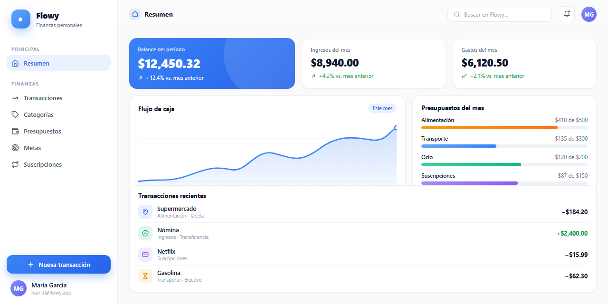
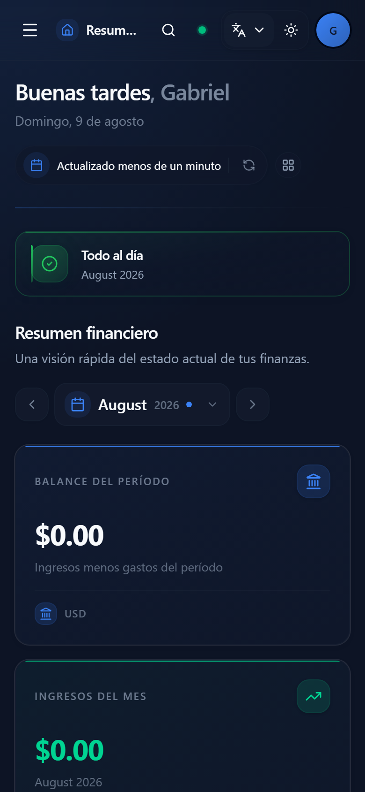

<div align="center">


# 🌊 Flowy

**A personal finance manager that flows with you.**

Track income and expenses, plan budgets, save toward goals, and keep an eye on recurring subscriptions — alone or in shared spaces with the people you trust. Works offline, syncs in realtime, speaks Spanish and English.

[](https://nextjs.org)
[](https://react.dev)
[](https://www.typescriptlang.org)
[](https://supabase.com)
[](https://www.prisma.io)
[](https://vercel.com)
[](https://tailwindcss.com)
[](https://developer.mozilla.org/en-US/docs/Web/Progressive_web_apps)
[](src/lib/i18n)
[](.github/workflows/ci.yml)
[](https://flowy-jade.vercel.app)
[](https://github.com/GabrielCrackPro/flowy/deployments)

</div>

---

## ✨ Highlights

| 💸 **Transactions** | 🎯 **Budgets** | 🏆 **Goals** |
| :--- | :--- | :--- |
| Income & expenses with categories, payment methods, notes, receipts and recurring entries | Monthly limits per category with live spending tracking | Savings targets with deadlines and progress tracking |

| 🔁 **Subscriptions** | 👥 **Spaces** | 🔔 **Alerts** |
| :--- | :--- | :--- |
| Recurring bills with billing cycles and next-payment dates | Shared workspaces with join codes, members, and per-space data | Overspending, low savings, upcoming payments, deadlines — deduplicated |

| 📊 **Dashboard** | 📝 **Comments & activity** | 📦 **Export** |
| :--- | :--- | :--- |
| Charts and configurable cards for balance, spending, and budget health | Discuss any entity and follow who changed what | Download transactions as a PDF |

Plus: **offline-first PWA** (installable, works without a connection, syncs when you're back), **realtime sync** across devices, **Spanish & English**, and **light/dark themes with customizable accent colors**.

## 📸 Screenshots

<div align="center">
  
  <br />
  
</div>

## 🧰 Tech Stack

| Layer | Choice |
| --- | --- |
| Framework | Next.js 16 (App Router), React 19, TypeScript |
| Styling | Tailwind CSS 4, shadcn/ui on Base UI and phantom-ui |
| Database | PostgreSQL via Supabase, Prisma ORM |
| Auth | Supabase Auth with server-side session validation |
| Data fetching | TanStack Query, react-hook-form with Zod |
| Charts | Recharts |
| Real-time & offline | Supabase Realtime, custom offline sync + PWA service worker |
| Notifications | Web Push, in-app alerts |
| Other | framer-motion, i18next, next-themes, sonner, jspdf, lucide-react |

## 🚀 Quick Start

### Prerequisites

- **Node.js 22.13+** (Next.js 16 needs 20.9+; CI runs on Node 24)
- **pnpm** (v11 — this repo uses a pnpm workspace)
- A **Supabase project** (free tier works)
- A **PostgreSQL connection string** for Prisma

### 1. Install dependencies

```bash
pnpm install
```

`postinstall` runs `prisma generate`, so the Prisma client is ready right after.

### 2. Configure environment variables

```bash
cp .env.example .env
```

Fill in the values — required: `DATABASE_URL`, `NEXT_PUBLIC_SUPABASE_URL`, `NEXT_PUBLIC_SUPABASE_ANON_KEY`, `SUPABASE_SERVICE_ROLE_KEY`. See the [environment variables](#-environment-variables) table.

### 3. Apply the database schema

Schema changes live in two places: raw SQL under `supabase/migrations/` (RLS policies, triggers, realtime) and the Prisma schema. On a fresh database, apply the SQL migrations first, then the Prisma migrations:

```bash
psql "$DATABASE_URL" -f supabase/migrations/001_init.sql
pnpm prisma migrate deploy
```

> ⚠️ Avoid `pnpm db:push` on a Supabase database — cross-schema references can break introspection.

### 4. Run it

```bash
pnpm dev
```

Open http://localhost:3000 — create an account, then add your first transactions and budgets.

## 📁 Project Structure

```text
src/app              Pages, API routes, auth, dashboard, manifest
src/components       Feature components and shared UI
src/hooks            Client hooks: data fetching, forms, filters
src/lib              Services, Supabase/Prisma clients, i18n, schemas, rate limiting
src/types            Shared TypeScript types
prisma               Prisma schema
supabase/migrations  SQL migrations (RLS, triggers, realtime, indexes)
.agents/skills       Agent skills for AI-assisted development
.githooks            Git hooks (pre-commit, commit-msg)
```

## 📜 Scripts

| Command | What it does |
| --- | --- |
| `pnpm dev` | Start the development server |
| `pnpm build` | Generate the Prisma client and build for production |
| `pnpm start` | Serve the production build |
| `pnpm lint` | Run Biome checks on the whole repo |
| `pnpm format` | Auto-format all files with Biome |
| `pnpm typecheck` | Run `tsc --noEmit` |
| `pnpm db:generate` | Regenerate the Prisma client |
| `pnpm prisma` | Run any Prisma CLI command |

## 🔐 Environment Variables

| Variable | Required | Purpose |
| --- | --- | --- |
| `DATABASE_URL` | ✅ | PostgreSQL connection string used by Prisma |
| `NEXT_PUBLIC_SUPABASE_URL` | ✅ | Supabase project URL |
| `NEXT_PUBLIC_SUPABASE_ANON_KEY` | ✅ | Supabase anonymous (publishable) key for the browser |
| `SUPABASE_SERVICE_ROLE_KEY` | ✅ | Service role key for admin/server operations — server only |
| `CRON_SECRET` | ✅ | Protects cron endpoints, e.g. `/api/cron/alerts` |
| `NEXT_PUBLIC_VAPID_PUBLIC_KEY` | — | Web Push public key (generate with `npx web-push generate-vapid-keys`) |
| `VAPID_PRIVATE_KEY` | — | Web Push private key — server only |
| `VAPID_SUBJECT` | — | Contact for the push service (defaults to `mailto:no-reply@flowy.app`) |
| `RATE_LIMIT_ENABLED` | — | `false` disables API rate limiting (enabled by default) |
| `RATE_LIMIT_*_REQUESTS` / `RATE_LIMIT_*_WINDOW` | — | Per-route rate limit overrides (requests / window in ms) |

`NEXT_PUBLIC_SUPABASE_PUBLISHABLE_KEY` is accepted as a fallback for `NEXT_PUBLIC_SUPABASE_ANON_KEY`. Every variable listed here is documented in `.env.example`.

## 🚢 Deployment

The project deploys on **Vercel**. `vercel.json` pins the build command, the region, and a daily cron that runs `/api/cron/alerts`.

1. Push the repo to GitHub and import it in Vercel
2. Add every variable from the [environment table](#-environment-variables) under Project Settings
3. Deploy — Vercel runs `pnpm install` (generating the Prisma client), then `pnpm build`
4. After deploying, run `pnpm prisma migrate deploy` against the production database once

💡 Commits whose message contains `[skip deploy]` cancel the deployment via Vercel's ignored build step — configured entirely in `vercel.json`, no dashboard setup needed.

▶️ **Manual deploy:** if a deploy was skipped (`[skip deploy]`) or failed, run the **Manual Deploy** workflow from the Actions tab — pick `production` or `preview` and a ref (branch/tag/SHA) to force it. Uses the `VERCEL_TOKEN` / `VERCEL_ORG_ID` / `VERCEL_PROJECT_ID` secrets. **Production manual deploys require your approval** — they run in the protected `deploy-production` environment (required reviewer + `main`-only branch policy), kept separate from Vercel's own `Production` environment so auto-deploys are never blocked.

### CI

Four GitHub Actions workflows guard the repo:

| Workflow | What it does |
| --- | --- |
| **CI** (`ci.yml`) | `pnpm lint`, `pnpm typecheck`, `pnpm build` plus a `Branch & PR conventions` guardrails job (branch naming, issue links, bot-exempt) on every PR and push to `main` |
| **Commit conventions** | PR titles and commit messages match conventional commits |
| **Release** | Release-please auto-generates the changelog + GitHub releases from conventional commits |
| **Manual Deploy** (`deploy-manual.yml`) | Triggered from the Actions tab (`workflow_dispatch`): deploy any ref to `production` or `preview`, with a post-deploy health check. Production runs in the protected `deploy-production` environment (needs your approval; `main` only) |

To make these required before merging, enable branch protection on `main` and mark them as required status checks.

## 🧑‍💻 Contributing

- **Commits** must follow [conventional commits](https://www.conventionalcommits.org) (`feat:`, `fix(scope):`, ...) — enforced by the local `commit-msg` hook and CI. For docs-only changes, `git commit --no-verify` skips the pre-commit checks.
- **Quality gates**: pre-commit runs Biome (lint-staged) and typecheck when the commit touches TypeScript; CI runs lint, typecheck, and build on every PR. All must pass.
- **Schema changes** ship as both a numbered SQL migration in `supabase/migrations/` and the matching Prisma schema update.
- **User-facing strings** must be added to both `src/lib/i18n/locales/en.ts` and `es.ts`.
- **Issues & board**: see [AGENTS.md](AGENTS.md) — AI agents in this repo use the `github-issues` skill to create issues and the `github-project-board` skill to triage the Flowy board.

## ❓ FAQ

**Can I host this somewhere other than Vercel?**
Yes — it's a standard Next.js build and runs on any Node.js host that provides the environment variables. You lose Vercel's cron for alerts unless you schedule `/api/cron/alerts` yourself.

**Do I need the service role key in the browser?**
No. `SUPABASE_SERVICE_ROLE_KEY` is server-only. The browser uses `NEXT_PUBLIC_SUPABASE_ANON_KEY`, and row-level security in `supabase/migrations/002_rls.sql` restricts what signed-in users can read and write.
